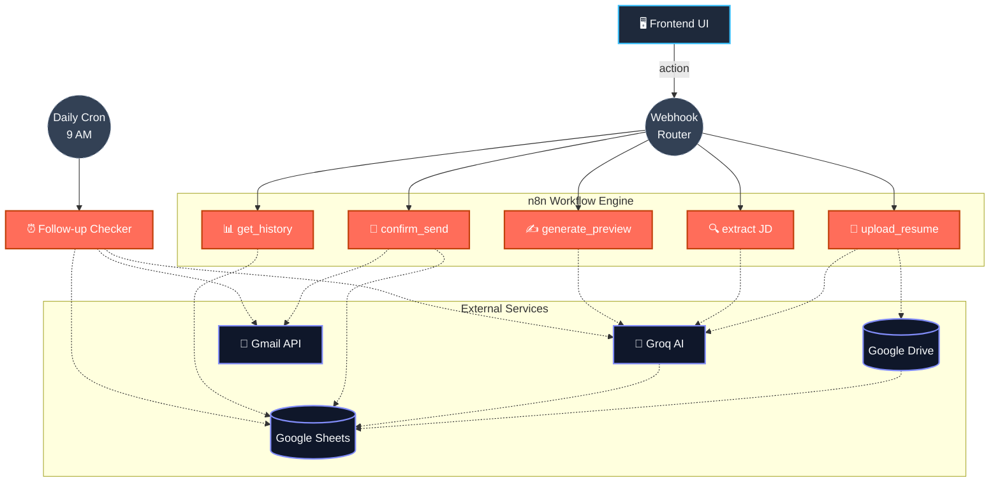

<div align="center">

# ⚡ ApplyMate

### AI-Powered Job Application Automation Engine

*Upload your resume once. Let AI write, personalize, and send your job applications — automatically.*

[](https://n8n.io)
[](https://groq.com)
[](https://sheets.google.com)
[](https://developers.google.com/gmail/api)
[](https://developer.mozilla.org/en-US/docs/Web/JavaScript)

</div>

---

## 🧠 What is this?

**ApplyMate** is a zero-cost, AI-driven pipeline that turns job hunting into a one-click workflow. Parse your resume once with an LLM, drop in any job description (manually or via image/auto-extract), and let an **AI Agent** write a sharp, human-sounding application email — tailored to *that specific JD* using *your actual resume data*. Review it, hit send, and the system tracks opens, logs everything to a live dashboard, and follows up automatically if HR goes quiet.

No SaaS subscriptions. No paid APIs. Just a webhook, an LLM, and some clean automation logic.

---

## ⚙️ Tech Stack

| Layer | Technology |
|---|---|
| **Orchestration** | [n8n](https://n8n.io) — visual workflow automation (self-hosted/cloud) |
| **LLM / AI Agent** | [Groq API](https://groq.com) running `llama-3.3-70b-versatile` — free-tier inference |
| **Resume Parsing** | n8n `Extract From File` + AI Agent → structured JSON (skills, projects, name) |
| **Email Engine** | Gmail API (OAuth2) — HTML emails + tracking pixel |
| **Data Store** | Google Sheets — zero-infra relational store for applications & resume cache |
| **File Storage** | Google Drive — resume hosting + attachment retrieval |
| **Frontend** | Vanilla HTML / CSS / JS — modern glassmorphism design, zero build step |
| **Structured Output** | LangChain Output Parser (via n8n) — enforces strict JSON schemas on every LLM call |

---

## 🏗️ Architecture



---

## ✨ Core Features

- 🧾 **One-time resume parsing** — AI extracts your name, skills, and top projects once; reused for every future application
- 🤖 **Dual input modes** — type JD manually, or auto-extract fields from pasted text/image via AI
- ✍️ **Context-aware email generation** — every email references the *actual* JD and *your* real resume content, not a generic template
- 👀 **Preview-before-send** — nothing goes out without your explicit confirmation
- 📎 **Auto-attached resume** — pulled directly from Drive at send time
- 📊 **Live application dashboard** — company, status, and open-tracking, all in Google Sheets
- 📬 **Open tracking** — invisible pixel reports when HR opens your email
- ⏰ **Autonomous follow-ups** — if no reply in 7 days, an AI-written nudge goes out automatically
- 💸 **$0 to run** — Groq's free tier + Google Workspace APIs + n8n's free executions
- 🎨 **Modern Design** — Dark mode glassmorphism UI built natively with CSS.

---

## 🚀 Getting Started

1. **Import the workflows** into n8n (`ApplyMate final.json` + `Follow-up-Checker_final.json`)
2. **Connect credentials**: Google Sheets, Google Drive, Gmail OAuth2, Groq API key
3. **Set up your sheet** with `Applications` and `CurrentResume` tabs
4. **Drop `config.js`** with your webhook URL into the frontend:
   ```javascript
   const CONFIG = {
       APPLY_WEBHOOK: "YOUR_N8N_WEBHOOK_URL_HERE"
   };
   ```
5. **Open `index.html`** in any modern web browser.
6. Upload your resume and start applying automatically!

> Full setup walkthrough lives in the workflow files' node comments — each branch is self-documenting via its action name.

---

## 📂 Project Structure

```text
ApplyMate/
├── index.html                    # Main UI — resume upload, JD input, preview, history
├── script.js                     # Frontend logic — fetch calls to n8n webhook
├── style.css                     # Modern Glassmorphism UI styling
├── config.js                     # Webhook URL config
├── ApplyMate final.json          # n8n workflow — core automation engine
└── Follow-up-Checker_final.json  # n8n workflow — scheduled follow-up logic
```

---

<div align="center">

**Built for job hunters who'd rather automate the grind and focus on interviews.**

⭐ if this saved you from writing 50 cover letters by hand

</div>
